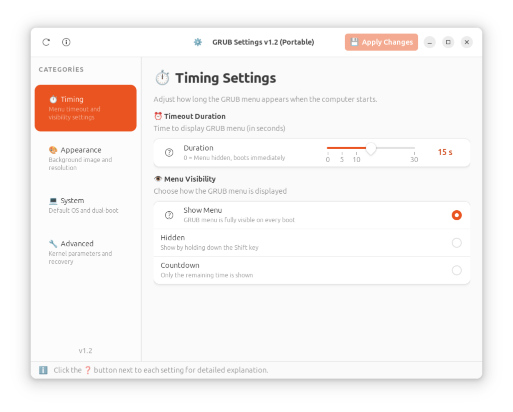
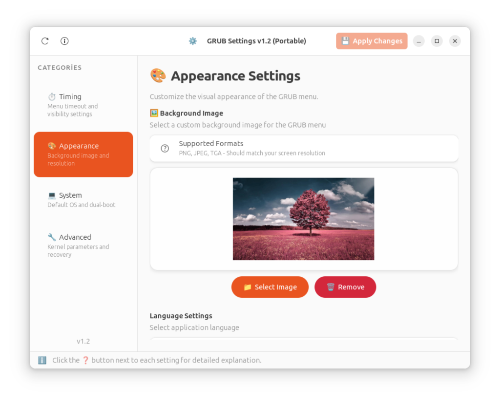
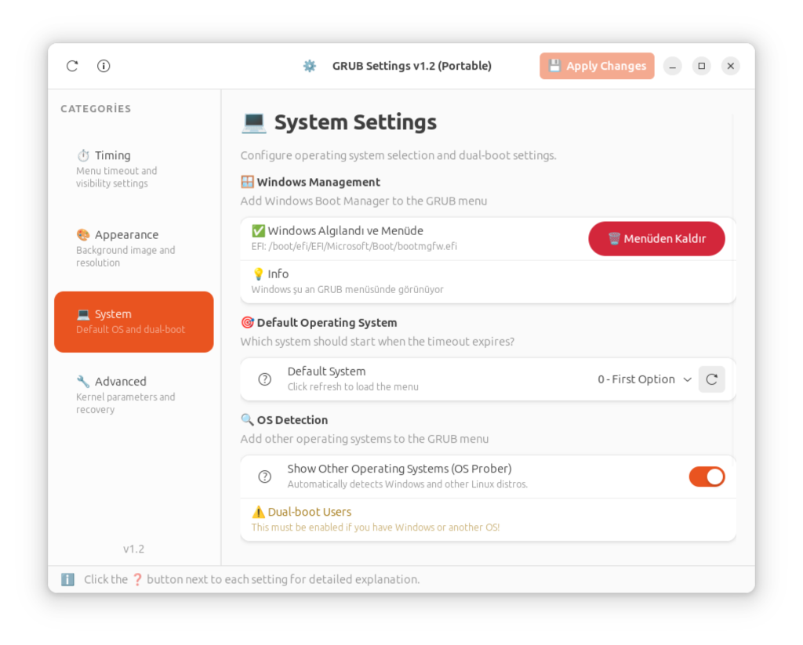
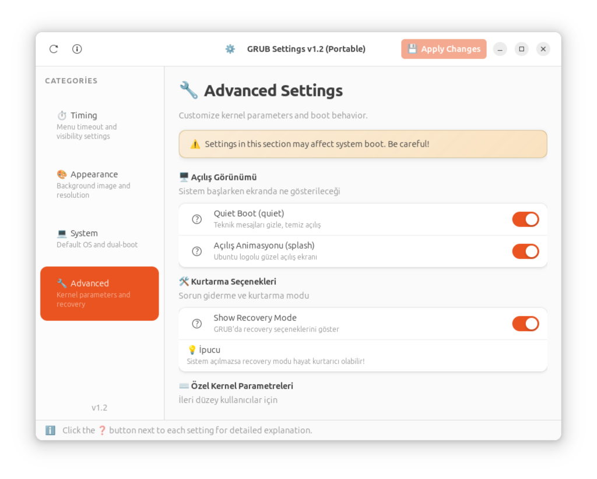

<div align="center">

# GRUB Settings ⚙️


### A modern, user-friendly, and polite GRUB customizer for Linux

*Configure your GRUB bootloader without touching config files*

[**📦 Download**](#-installation) • [**✨ Features**](#-features) • [**📖 Documentation**](#-documentation) • [**🤝 Contributing**](#-contributing)

---

</div>

## 📸 Screenshots

<div align="center">

| Timing Settings | Appearance |
|:---------------:|:----------:|
|  |  |

| System Settings | Advanced |
|:---------------:|:--------:|
|  |  |

</div>

## ✨ Features

### 🎨 Modern Interface
- **GTK4 + LibAdwaita** design with dark mode support
- Clean, intuitive navigation sidebar
- Responsive layout for all screen sizes

### ⏱️ Timing Settings
| Feature | Description |
|---------|-------------|
| **Menu Timeout** | Set how long GRUB menu appears (0-30 seconds) |
| **Visibility Style** | Show Menu / Hidden (Shift key) / Countdown only |
| **Remember Selection** | Auto-select last booted OS |

### 🖼️ Appearance
| Feature | Description |
|---------|-------------|
| **Background Image** | Set custom PNG/JPEG/TGA background |
| **Screen Resolution** | Configure GRUB display resolution |
| **Live Preview** | See your background before applying |

### 💻 System Settings
| Feature | Description |
|---------|-------------|
| **Default OS** | Choose which OS boots automatically |
| **Windows Detection** | Manually add Windows if OS-Prober fails |
| **OS Prober** | Toggle automatic OS detection |
| **Submenus** | Group old kernels in submenu |

### 🔧 Advanced Settings
| Feature | Description |
|---------|-------------|
| **Quiet Boot** | Hide technical boot messages |
| **Splash Screen** | Plymouth boot animation toggle |
| **Recovery Mode** | Show/hide recovery options |
| **Kernel Parameters** | Custom kernel command line |

### 🔐 Polite Authentication
- **No root startup** - App starts normally without password
- **On-demand sudo** - Password only when applying changes
- **Session caching** - No repeated prompts
- **Universal dialog** - Works on GNOME, KDE, XFCE, and tiling WMs

### 🌐 Internationalization
- 🇬🇧 English
- 🇹🇷 Türkçe (Turkish)
- *More languages coming soon!*

### 🎨 Theme Support
- **System** - Follow system theme
- **Light** - Force light mode
- **Dark** - Force dark mode

---

## 📦 Installation

### Debian / Ubuntu (.deb Package) ⭐ Recommended

The easiest way - dependencies are installed automatically!

```bash
# Download the package
wget https://github.com/bingoweb/grub-settings/releases/latest/download/grub-settings_0.1.0_all.deb

# Install with dependencies
sudo apt install ./grub-settings_0.1.0_all.deb

# Run from menu or terminal
grub-settings
```

### Flatpak (Coming Soon)

```bash
flatpak install flathub io.github.taylan.grubsettings
```
*Flathub submission is pending review.*

### From Source

```bash
# Clone
git clone https://github.com/bingoweb/grub-settings.git
cd grub-settings

# Run
python3 grub_settings.py
```

**Dependencies:**
```bash
# Debian/Ubuntu
sudo apt install python3-gi gir1.2-gtk-4.0 gir1.2-adw-1

# Fedora
sudo dnf install python3-gobject gtk4 libadwaita

# Arch Linux
sudo pacman -S python-gobject gtk4 libadwaita
```

---

## 📖 Documentation

### How It Works

GRUB Settings modifies `/etc/default/grub` and runs `update-grub` to apply changes. It provides a safe, visual way to configure:

```
GRUB_TIMEOUT=5
GRUB_TIMEOUT_STYLE=menu
GRUB_DEFAULT=0
GRUB_CMDLINE_LINUX_DEFAULT="quiet splash"
GRUB_BACKGROUND="/path/to/image.png"
GRUB_GFXMODE=1920x1080
```

### Supported Distributions

| Distribution | Status | Notes |
|--------------|--------|-------|
| Ubuntu 22.04+ | ✅ Tested | Full support |
| Debian 12+ | ✅ Tested | Full support |
| Fedora 38+ | ✅ Tested | Full support |
| Arch Linux | ✅ Tested | Full support |
| Linux Mint | ✅ Tested | Ubuntu-based |
| Pop!_OS | ✅ Tested | Ubuntu-based |
| openSUSE | ⚠️ Untested | Should work |

### FAQ

<details>
<summary><b>❓ Why does the app need sudo?</b></summary>

GRUB configuration is stored in `/etc/default/grub` which requires root access. The app only asks for password when you click "Apply Changes".
</details>

<details>
<summary><b>❓ Will this break my system?</b></summary>

No. The app creates a backup before making changes. If something goes wrong, you can restore from `/etc/default/grub.backup`.
</details>

<details>
<summary><b>❓ Windows not detected?</b></summary>

1. Enable "OS Prober" in System Settings
2. If still not detected, use "Add Windows Manually" option
3. Click "Apply Changes" and reboot
</details>

<details>
<summary><b>❓ How do I reset to defaults?</b></summary>

```bash
sudo cp /etc/default/grub.backup /etc/default/grub
sudo update-grub
```
</details>

<details>
<summary><b>❓ Can I add more languages?</b></summary>

Yes! Create a new JSON file in `locales/` folder and add it to `languages.json`. See existing translations as reference.
</details>

---

## 🛠️ Development

### Project Structure

```
grub-settings/
├── grub_settings.py      # Main application
├── assets/               # Icons and images
├── locales/              # Translation files
│   ├── languages.json    # Language registry
│   ├── en.json           # English
│   └── tr.json           # Turkish
├── flatpak/              # Flatpak packaging
├── packaging/            # .deb packaging
└── screenshots/          # App screenshots
```

### Building Packages

```bash
# Build .deb package
dpkg-deb --build packaging/deb packaging/grub-settings_0.1.0_all.deb

# Test Flatpak
flatpak-builder --user --install build-dir flatpak/io.github.taylan.grubsettings.yml
```

---

## 🤝 Contributing

Contributions are welcome! Here's how you can help:

1. **🐛 Report Bugs** - Open an [issue](https://github.com/bingoweb/grub-settings/issues)
2. **🌐 Add Translations** - Help translate to your language
3. **💻 Submit PRs** - Fix bugs or add features
4. **⭐ Star the repo** - Show your support!

---

## 📄 License

This project is licensed under the **GPL-3.0 License** - see the [LICENSE](LICENSE) file for details.

---

## 👨‍💻 Author

**Taylan Soylu**

[](https://github.com/bingoweb)
[](mailto:taylansoylu@gmail.com)

---

<div align="center">

**Made with ❤️ for the Linux community**

*If you find this useful, please consider giving it a ⭐*

</div>
